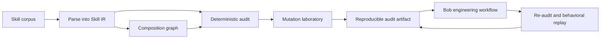

# Crucible Skills

**Verification engineering for AI agent methodologies.**

[English](README.md) · [Español](README_ES.md) · **[Technical README](TECHNICAL.md)**

> **Status: In progress — architecture and evaluation contract first.**

Agent skills are executable methodology: they change what a capable coding agent notices, prioritizes, verifies, and does. Existing tools can validate their shape, scan them for malicious behavior, and evaluate whether an agent performs better with them. That still leaves a harder question:

> **Is this methodology coherent, verifiable, composable, and worth adding to the corpus?**

Crucible Skills is being built to answer that question with structured evidence instead of an opaque quality score.

## The idea in one example

Two skills can each look reasonable while creating a bad composition:

```text
Skill A: retry critical operations until they succeed.
Skill B: irreversible operations must have bounded, reviewable effects.

Individually plausible → jointly unsafe when retries duplicate an irreversible effect.
```

Crucible extracts the declared rules, scopes, triggers, checks, references, and composition edges; then it tests the corpus for contradictions, missing verification, redundancy, broken provenance, and mutation resistance.



## What makes it different

| Existing question | Crucible question |
|---|---|
| Is the file valid? | Does the methodology declare a coherent contract? |
| Is the skill dangerous? | Does its composition create a new failure surface? |
| Does an agent score better with it? | Which invariant changed, and can the change be reproduced? |
| Is the text similar to another skill? | Is it redundant, compositional, reinforcing, or contradictory? |

Crucible is intended to complement security scanners and live agent evaluators, not to replace them.

## Planned verification layers

1. **Corpus compiler** — parse frontmatter, normative language, scopes, triggers, checks, references, provenance, and declared composition into a versioned intermediate representation.
2. **Deterministic auditor** — find broken references, orphaned skills, cycles, scope conflicts, trigger collisions, requirements without checks, unsupported numeric claims, and structural duplication.
3. **Composition analysis** — distinguish redundancy, composition, reinforcement, and contradiction rather than treating every overlap as a duplicate.
4. **Mutation laboratory** — deliberately weaken or distort a valid skill and measure whether the auditor kills the mutant.
5. **Behavioral differential** — compare baseline, original, mutated, and repaired methodology on the same task with explicit properties.
6. **Bob workflow** — let IBM Bob investigate, repair, and challenge findings while Crucible remains the authority that verifies the result.

## Current state

This repository currently contains the project map, technical contract, decision records, and red-team charter. Implementation begins only after these documents stabilize the destination and its invariants.

The intended stopping rule is deliberate: under a deadline, reach fewer complete levels rather than many disposable slices. Every level must remain useful and compatible with the final system.

## Repository map

```text
crucible-skills/
├── README.md              # primary project narrative
├── README_ES.md           # Spanish project adaptation
├── TECHNICAL.md           # architecture, contracts, threats, evidence
├── docs/
│   ├── ROADMAP.md         # public construction map
│   ├── decisions/         # durable architectural decisions
│   └── red-team/          # adversarial review plans and evidence
└── src/                   # implementation will arrive by coherent level
```

## Why “Crucible”

A skill should survive heat: parsing, composition, deliberate mutation, adversarial review, and replay. The name describes the verification process, not a claim that the output is universally safe.

## License

License selection is pending the hackathon submission requirements and dependency review.
