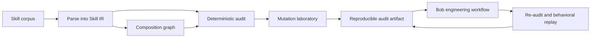

# Crucible Skills

**Verification engineering for AI agent methodologies.**

[English](README.md) · [Español](README_ES.md) · **[Technical README](TECHNICAL.md)**


> **Status: In progress — architecture and evaluation contract first.**

Agent skills are executable methodology: they change what a capable coding agent notices, prioritizes, verifies, and does. Existing tools can validate their shape, scan them for malicious behavior, and evaluate whether an agent performs better with them. That still leaves a harder question:

> **Is this methodology coherent, verifiable, composable, and worth adding to the corpus?**

Crucible Skills is being built to answer that question with structured evidence instead of an opaque quality score.

## Why this exists now

Agent Skills are becoming infrastructure. NVIDIA is already building serious infrastructure around them: SkillSpector addresses security and supply-chain risk; SkillEvaluator covers validation, semantic overlap, synthetic evaluation, and live agent comparison; and the NVIDIA catalog adds Skill Cards, signatures, benchmark artifacts, and publication gates. We want those controls. CRUCIBLE does not exist because they are unimportant; it exists because they do not exhaust the methodology question.

> **A skill does not need to be malicious to be harmful methodology. It can be perfectly benign and still teach an agent to engineer badly.**

For example:

```text
Skill A: retry failed operations until success.
Skill B: irreversible actions must be bounded and reviewable.

Neither is necessarily malicious in isolation.
The composition is problematic when the retry target is irreversible and non-idempotent.
```

CRUCIBLE is designed to make that kind of claim inspectable, conditional, and falsifiable. It is a complementary methodology-verification layer, not a replacement security scanner or live-agent evaluator. See the [competitive boundary](docs/COMPETITIVE_BOUNDARY.md) for the evidence-backed comparison.

## The idea in one example

Two skills can each look reasonable while creating a bad composition:

```text
Skill A: retry critical operations until they succeed.
Skill B: irreversible operations must have bounded, reviewable effects.

Individually plausible → jointly unsafe when retries duplicate an irreversible effect.
```

Crucible extracts the declared rules, scopes, triggers, checks, references, and composition edges; then it tests the corpus for contradictions, missing verification, redundancy, broken provenance, and mutation resistance.



## What makes it different

| Existing question | Crucible question |
|---|---|
| Is the file valid? | Does the methodology declare a coherent contract? |
| Is the skill dangerous? | Does its composition create a new failure surface? |
| Does an agent score better with it? | Which invariant changed, and can the change be reproduced? |
| Is the text similar to another skill? | Is it redundant, compositional, reinforcing, or contradictory? |

Crucible is intended to complement security scanners and live agent evaluators, not to replace them.

## Planned verification layers

1. **Corpus compiler** — parse frontmatter, normative language, scopes, triggers, checks, references, provenance, and declared composition into a versioned intermediate representation.
2. **Deterministic auditor** — find broken references, orphaned skills, cycles, scope conflicts, trigger collisions, requirements without checks, unsupported numeric claims, and structural duplication.
3. **Composition analysis** — distinguish redundancy, composition, reinforcement, and contradiction rather than treating every overlap as a duplicate.
4. **Mutation laboratory** — deliberately weaken or distort a valid skill and measure whether the auditor kills the mutant.
5. **Behavioral differential** — compare baseline, original, mutated, and repaired methodology on the same task with explicit properties.
6. **Bob workflow** — let IBM Bob investigate, repair, and challenge findings while Crucible remains the authority that verifies the result.

## The NVIDIA/Nebius experiment

For the Nebius x NVIDIA Global AI Hackathon, the NVIDIA open-source model must have a real experimental role. The planned experiment pins one task, corpus, skill variant, model/runtime, and property oracle, then compares:

```text
no skill → original skill → deliberate mutant → candidate repair
```

The model generates the agent behavior that the oracle observes. CRUCIBLE records the model/runtime metadata and keeps deterministic findings separate from behavioral observations. The integration contract and current requirement matrix are in [`docs/NVIDIA_INTEGRATION.md`](docs/NVIDIA_INTEGRATION.md).

The hackathon requires a working application running on Nebius Token Factory or Nebius AI Cloud, at least one NVIDIA open-source model, an open-source public repository, README setup instructions, a working demo or test build where applicable, and a public demo video of three minutes or less. These are planned submission obligations, not claims that the current repository already satisfies them.

## Current state

This repository has the first six coherent implementation levels:

- **L1 — Corpus compiler:** parses `SKILL.md` frontmatter, normative language (RFC-2119 modals, absoluteness starters, imperative constraint verbs), checks, relations, and references into a versioned, source-addressable Skill IR (`skill-ir/v1`) with deterministic SHA-256 artifact digests. Style-agnostic extraction recognizes skills written in any valid convention, not only RFC-2119.
- **L2 — Deterministic auditor:** consumes the L1 IR and emits findings with source evidence and epistemic status (CONFIRMED / CANDIDATE / OBSERVATION), seals an AuditArtifact (`crucible-audit/v1`), and documents 0 abstained checks (all 20 are emitted). 20 checks are emitted: BROKEN_REFERENCE, SELF_COMPOSITION, COMPOSITION_CYCLE, ORPHAN_SKILL, REQUIREMENT_WITHOUT_CHECK, STRUCTURAL_REDUNDANCY, METHODOLOGICAL_VACUITY (rules but no steps and no checks), NORMATIVE_CONFLICT (same subject, opposite modality), SEMANTIC_REDUNDANCY (Jaccard token overlap >= 2/3 with Fraction, no floats; LLM confirmation layer deferred), CONDITIONAL_CONTRADICTION (same subject, overlapping conditions, opposite effective polarity), SCOPE_TRIGGER_MISMATCH (declared trigger shares zero tokens with rule content), DESCRIPTION_BODY_GAP (substantive description but zero extractable rules, checks, and procedural steps; 15 CANDIDATE findings on real corpus), CHECK_WITHOUT_ORACLE (check text has no extractable verification indicator; oracle_kind extraction: question/checkbox/command/unknown; 16 CANDIDATE findings on real corpus), CLAIM_WITHOUT_PROVENANCE (rule makes a numeric/standards claim without a source citation; claim extraction: percentage/time/count/standard/year with provenance detection; 0 findings on real corpus), UNBOUNDED_RETRY (retry/repeat without max attempts, timeout, backoff, or circuit breaker; 4 CANDIDATE findings on real corpus), LLM_IN_DECISION_PATH (LLM/model used for a consequential decision without a deterministic guard; 0 findings on real corpus), OVERCLAIM (absolute claim — always, never, guaranteed, failsafe — without qualification; 2 CANDIDATE findings on real corpus), MISSING_FAILURE_MODE (rules and steps but zero mention of failure, error, exception, fallback, or recovery; 0 findings on real corpus), NON_DETERMINISTIC_INSTRUCTION (random, arbitrary, pick any — without a seed or reproducible anchor; 3 CANDIDATE findings on real corpus), and IRREVERSIBLE_WITHOUT_REVIEW (delete, drop, destroy, force-push, truncate, purge — without review, backup, idempotency, or rollback; 18 CANDIDATE findings on real corpus). The IR extracts rule subjects, conditions, triggers, procedural steps, check oracle_kind, and rule claims to support these checks.
- **L2.5 — Semantic redundancy confirmation layer:** takes ALL CANDIDATE findings from the L2 audit and asks an executor (Nemotron via Nebius, or deterministic mock) whether each is a true defect or a false positive. Supported CANDIDATE types: SEMANTIC_REDUNDANCY (pair-wise), CHECK_WITHOUT_ORACLE, DESCRIPTION_BODY_GAP, REQUIREMENT_WITHOUT_CHECK, SCOPE_TRIGGER_MISMATCH. The confirmation is a separate artifact (`crucible-confirmation/v1`) with its own SHA-256 digest. The L2 audit artifact is NEVER modified — the confirmation is an OBSERVATION, not a promotion to CONFIRMED. If `NEBIUS_API_KEY` is not set, the confirmation is BLOCKED, not simulated.
- **L3 — Composition graph:** extracts typed relation edges from both L1 section headings and description text (sibling of, pairs with, composes with, member of the family, companion to), classifies them into composition/reinforcement/delegation, detects hubs and disconnected components, and seals a GraphArtifact (`crucible-graph/v1`). The real corpus produces 83 edges, 12 hubs, and 4 disconnected components.
- **L4 — Mutation laboratory:** seeds 8 defect classes against a known-good base fixture, runs the full pipeline, and classifies results as KILLED / SURVIVED / ABSTAINED. Survivors are classified by cause (INSUFFICIENT_DETECTOR, INSUFFICIENT_REPRESENTATION, OUT_OF_SCOPE). Kill rate: 4/6 (excluding abstained). The lab answers: when we introduce a defect we claim to detect, do we actually detect it?
- **L5 — Behavioral differential:** runs the same task against 4 skill variants (no-skill, original, mutant, repair), observes 4 explicit properties with a deterministic oracle, and seals the report. The local executor shows the expected differential (mutant fails P3: unbounded retry). The Nebius/Nemotron executor is real code using the Token Factory API; execution is BLOCKED until an API key is available. The model is the subject of observation, not the judge.
- **L6 — Bob workflow:** Bob receives audit findings, proposes a repair (rule-based or LLM via Nebius), and Crucible deterministically re-audits and accepts or rejects. Acceptance criteria: the targeted finding is gone AND no new findings AND the corpus compiles. Bob proposes; Crucible decides.
- **L7 — Closed repair loop:** integrates L6 and L5 into a single closed workflow. Bob proposes a repair; Crucible re-audits deterministically (L6); if the deterministic gate passes, the loop runs a behavioral replay (L5 property oracle) comparing the repaired skill against the original. A repair that passes deterministic but fails behavioral is REJECTED with `BEHAVIORAL_REGRESSION`. Bob proposes; the property oracle observes; Crucible decides.
- **L8 — CI and presentation:** a composite report generator runs the full L1-L7 pipeline and seals a `crucible-report/v1` artifact with all level digests. A read-only HTML viewer renders any sealed artifact JSON as a self-contained page (no computation, no `<script>` tags). A GitHub Actions CI workflow runs tests, generates the report, renders HTML, and uploads both as artifacts. No consumer has independent decision logic.

L1 has been exercised against the local real corpus (103 skills, 140 extracted normative lines, 175 checks). L2 produces 1 finding (a CANDIDATE requirement-without-check) and 5 documented limitations. L3 produces 83 typed edges and reveals the corpus structure (12 hub skills, 4 disconnected components, 38 isolated skills). L4 produces 4 killed, 2 survived, 2 abstained, with honest survivor classification. L5 produces the expected behavioral differential with the local executor; Nebius execution is BLOCKED. L6 accepts a rule-based repair for the REQUIREMENT_WITHOUT_CHECK finding; the LLM proposer is BLOCKED (no API key). L7 accepts a rule-based repair that passes both deterministic re-audit and behavioral replay; the LLM proposer and Nebius executor are BLOCKED (no API key). L8 produces a sealed composite report, a read-only HTML viewer, and a CI workflow. All levels are closed.

### Run L1-L8 locally

```bash
PYTHONPATH=src python3 -m pytest -q
# Run the full L1-L7 composite report (L8, no API key needed):
PYTHONPATH=src python3 -m crucible.cli --report --local-executor > crucible-report.json
# Render the report as a self-contained HTML page (L8):
PYTHONPATH=src python3 -m crucible.cli --view crucible-report.json > crucible-report.html
# Run the closed repair loop with rule-based proposer (L7, no API key needed):
PYTHONPATH=src python3 -m crucible.cli --repair-loop --local-executor > repair-loop-report.json
# Run the closed repair loop with LLM proposer (L7, needs NEBIUS_API_KEY):
PYTHONPATH=src python3 -m crucible.cli --repair-loop --llm-proposer > repair-loop-report.json
# Run the Bob workflow with rule-based proposer (L6, no API key needed):
PYTHONPATH=src python3 -m crucible.cli --bob > bob-report.json
# Run the Bob workflow with LLM proposer (L6, needs NEBIUS_API_KEY):
PYTHONPATH=src python3 -m crucible.cli --bob --llm-proposer > bob-report.json
# Run the behavioral differential with local executor (L5, no API key needed):
PYTHONPATH=src python3 -m crucible.cli --behave --local-executor > behavioral-report.json
# Run the behavioral differential with Nebius (L5, needs NEBIUS_API_KEY):
PYTHONPATH=src python3 -m crucible.cli --behave > behavioral-report.json
# Run the mutation lab (L4):
PYTHONPATH=src python3 -m crucible.cli --mutate > mutation-report.json
# Compile, audit, and build composition graph (L1+L2+L3):
PYTHONPATH=src python3 -m crucible.cli /path/to/skill-corpus > graph-artifact.json
# Compile and audit without graph:
PYTHONPATH=src python3 -m crucible.cli --no-graph /path/to/skill-corpus > audit-artifact.json
# Compile only (L1 IR):
PYTHONPATH=src python3 -m crucible.cli --compile-only /path/to/skill-corpus > ir.json
```

The current corpus numbers are an observed run, not a universal benchmark. See the parser boundary in [ADR-0002](docs/decisions/0002-conservative-frontmatter-parser.md).

The intended stopping rule is deliberate: under a deadline, reach fewer complete levels rather than many disposable slices. Every level must remain useful and compatible with the final system.

## Repository map

```text
crucible-skills/
├── README.md              # primary project narrative
├── README_ES.md           # Spanish project adaptation
├── TECHNICAL.md           # architecture, contracts, threats, evidence
├── docs/
│   ├── ROADMAP.md         # public construction map
│   ├── COMPETITIVE_BOUNDARY.md # NVIDIA overlap and surviving gap
│   ├── NVIDIA_INTEGRATION.md   # hackathon requirements and runtime contract
│   ├── EVALUATION_PLAN.md      # metrics, fixtures, and negative controls
│   ├── SOURCES.md              # source-backed research record
│   ├── decisions/         # durable architectural decisions
│   └── red-team/          # adversarial review plans and evidence
├── src/crucible/
│   ├── ir.py              # canonical serialization and SHA-256 sealing
│   ├── compiler.py        # L1: SKILL.md → versioned Skill IR
│   ├── auditor.py         # L2: deterministic audit engine
│   ├── graph.py           # L3: typed composition graph
│   ├── mutation.py        # L4: mutation laboratory
│   ├── behavioral.py      # L5: behavioral differential harness
│   ├── bob.py             # L6: Bob engineering workflow
│   ├── repair_loop.py     # L7: closed repair loop
│   ├── report.py          # L8: composite report generator (L1-L7)
│   ├── viewer.py          # L8: read-only HTML artifact viewer
│   └── cli.py             # compile + audit + graph + mutate + behave + bob + repair-loop + report + view CLI
└── tests/
    ├── test_compiler_contract.py  # L1 falsifiable contract tests
    ├── test_auditor_contract.py   # L2 falsifiable contract tests
    ├── test_graph_contract.py     # L3 falsifiable contract tests
    ├── test_mutation_contract.py  # L4 falsifiable contract tests
    ├── test_behavioral_contract.py # L5 falsifiable contract tests
    ├── test_bob_contract.py       # L6 falsifiable contract tests
    ├── test_repair_loop_contract.py # L7 falsifiable contract tests
    ├── test_report_viewer_contract.py # L8 falsifiable contract tests
    └── test_end_to_end.py         # L1-L7 integration tests
```

## Why “Crucible”

A skill should survive heat: parsing, composition, deliberate mutation, adversarial review, and replay. The name describes the verification process, not a claim that the output is universally safe.

## License

Apache-2.0. See [`LICENSE`](LICENSE).
