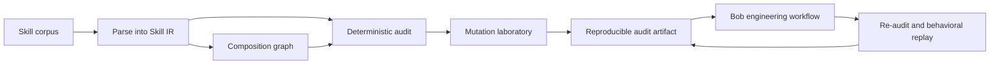

# Crucible

**Verification engineering for AI agent methodologies — built on Nebius AI Cloud with NVIDIA Nemotron.**

[English](README.md) · [Español](README_ES.md) · **[Technical README](TECHNICAL.md)**


> **Status: In progress — architecture and evaluation contract first.**

Agent skills are executable methodology: they change what a capable coding agent notices, prioritizes, verifies, and does. Existing tools can validate their shape, scan them for malicious behavior, and evaluate whether an agent performs better with them. That still leaves a harder question:

> **Is this methodology coherent, verifiable, composable, and worth adding to the corpus?**

Crucible answers that question with structured evidence instead of an opaque quality score.

## Built With

| Tool | Role |
|------|------|
| **Nebius AI Cloud** | Model execution platform for the behavioral differential harness (L5) and the semantic confirmation layer (L2.5) |
| **Nebius Token Factory** | API authentication and token management for model inference |
| **NVIDIA Nemotron** (`nvidia/nemotron-3-super-120b-a12b`) | The open-source model that generates agent behavior observed by deterministic property oracles; also used for semantic confirmation of audit findings |

The model is **causal to the experiment**, not a narrator. It generates the agent behavior that deterministic oracles observe. The LLM never touches the decision path — all findings, seals, and verdicts are deterministic.

## Why this exists now

Agent Skills are becoming infrastructure. NVIDIA is already building serious infrastructure around them: SkillSpector addresses security and supply-chain risk; SkillEvaluator covers validation, semantic overlap, synthetic evaluation, and live agent comparison; and the NVIDIA catalog adds Skill Cards, signatures, benchmark artifacts, and publication gates. We want those controls. Crucible does not exist because they are unimportant; it exists because they do not exhaust the methodology question.

> **A skill does not need to be malicious to be harmful methodology. It can be perfectly benign and still teach an agent to engineer badly.**

For example:

```text
Skill A: retry failed operations until success.
Skill B: irreversible actions must be bounded and reviewable.

Neither is necessarily malicious in isolation.
The composition is problematic when the retry target is irreversible and non-idempotent.
```

Crucible makes that kind of claim inspectable, conditional, and falsifiable. It is a complementary methodology-verification layer, not a replacement security scanner or live-agent evaluator. See the [competitive boundary](docs/COMPETITIVE_BOUNDARY.md).

## The idea in one example

Two skills can each look reasonable while creating a bad composition:

```text
Skill A: retry critical operations until they succeed.
Skill B: irreversible operations must have bounded, reviewable effects.

Individually plausible → jointly unsafe when retries duplicate an irreversible effect.
```

Crucible extracts the declared rules, scopes, triggers, checks, references, and composition edges; then it tests the corpus for contradictions, missing verification, redundancy, broken provenance, and mutation resistance.



## What makes it different

| Existing question | Crucible question |
|---|---|
| Is the file valid? | Does the methodology declare a coherent contract? |
| Is the skill dangerous? | Does its composition create a new failure surface? |
| Does an agent score better with it? | Which invariant changed, and can the change be reproduced? |
| Is the text similar to another skill? | Is it redundant, compositional, reinforcing, or contradictory? |

Crucible complements security scanners and live agent evaluators, not replaces them.

## The Nebius x NVIDIA experiment

For the Nebius x NVIDIA Global AI Hackathon, the NVIDIA open-source model has a real experimental role. The experiment pins one task, corpus, skill variant, model/runtime, and property oracle, then compares:

```text
no skill → original skill → deliberate mutant → candidate repair
```

The model generates the agent behavior that the oracle observes. Crucible records the model/runtime metadata and keeps deterministic findings separate from behavioral observations. The integration contract is in [`docs/NVIDIA_INTEGRATION.md`](docs/NVIDIA_INTEGRATION.md).

**Current status:** the Nebius/Nemotron integration is code-complete but execution is BLOCKED until an API key is available. The system honestly reports `nebius_blocked: true` and falls back to the local deterministic executor. No simulated results are claimed.

## Verification layers

1. **L1 — Corpus compiler:** parses `SKILL.md` frontmatter, normative language (RFC-2119 modals, absoluteness starters, imperative constraint verbs), checks, relations, and references into a versioned, source-addressable Skill IR with SHA-256 digests.
2. **L2 — Deterministic auditor:** 28 checks covering normative conflicts, vacuity, redundancy, scope/trigger mismatch, requirement-without-check, claim-without-provenance, check-without-oracle, description-body gap, unbounded retry, irreversible-without-review, missing timeout, floating-point-in-decision-path, unpinned dependency, overgeneralization, and more. All findings carry source evidence and epistemic status.
3. **L2.5 — Semantic confirmation:** Nemotron confirms or refutes CANDIDATE findings via Nebius. The confirmation is a separate artifact — the L2 audit is never modified. Without `NEBIUS_API_KEY`, the confirmation is BLOCKED, not simulated.
4. **L3 — Composition graph:** typed relation edges, cycle detection, orphan skills, hubs, and disconnected components.
5. **L4 — Mutation laboratory:** 8 seeded mutations with **100% kill rate (6/6 killed, 2 abstained as out-of-scope, 0 survived)**. Every defect class we claim to detect, we actually detect.
6. **L5 — Behavioral differential:** runs the same task against 4 skill variants (no-skill, original, mutant, repair) with 4 deterministic property oracles. The model is the subject of observation, not the judge.
7. **L6 — Bob workflow:** Bob receives findings, proposes a repair, and Crucible deterministically re-audits and accepts or rejects. Bob proposes; Crucible decides.
8. **L7 — Closed repair loop:** integrates L6 and L5. A repair that passes deterministic but fails behavioral is REJECTED with `BEHAVIORAL_REGRESSION`.
9. **L8 — CI and presentation:** composite report, read-only HTML viewer, GitHub Actions CI with determinism verification, mutation kill rate gate, and security regression.
10. **L9-L13 — Style-agnostic extraction, engineering defect taxonomy, public API, Nemotron confirmation, corpus-agnostic validation.**

## Run it

```bash
# Install
pip install -e ".[test]"

# Run the test suite (420 tests)
PYTHONPATH=src python3 -m pytest -q

# Full L1-L7 report (local deterministic, no API key needed)
PYTHONPATH=src python3 -m crucible.cli --report --local-executor > crucible-report.json

# Render as self-contained HTML
PYTHONPATH=src python3 -m crucible.cli --view crucible-report.json > crucible-report.html

# Mutation lab (L4, 100% kill rate)
PYTHONPATH=src python3 -m crucible.cli --mutate > mutation-report.json

# Behavioral differential with Nebius (L5, needs NEBIUS_API_KEY)
PYTHONPATH=src python3 -m crucible.cli --behave > behavioral-report.json

# Scan a single SKILL.md from stdin
cat SKILL.md | PYTHONPATH=src python3 -m crucible.cli --scan-skill > audit.json

# Scan your installed skills
PYTHONPATH=src python3 -m crucible.cli --scan-installed > installed-audit.json

# Start the HTTP API server
PYTHONPATH=src python3 -m crucible.cli --serve 127.0.0.1:8000

# Or run via Docker
docker build -t crucible . && docker run -p 8000:8000 crucible
```

## Repository map

```text
crucible/
├── README.md              # primary project narrative
├── README_ES.md           # Spanish project adaptation
├── TECHNICAL.md           # architecture, contracts, threats, evidence
├── docs/
│   ├── ROADMAP.md         # public construction map
│   ├── COMPETITIVE_BOUNDARY.md # NVIDIA overlap and surviving gap
│   ├── NVIDIA_INTEGRATION.md   # hackathon requirements and runtime contract
│   ├── PRE_EXISTING_PROJECT_DISCLOSURE.md # hackathon origin disclosure
│   ├── EVALUATION_PLAN.md      # metrics, fixtures, and negative controls
│   ├── decisions/         # durable architectural decisions
│   └── red-team/          # adversarial review plans and evidence
├── src/crucible/
│   ├── ir.py              # canonical serialization and SHA-256 sealing
│   ├── compiler.py        # L1: SKILL.md → versioned Skill IR
│   ├── auditor.py         # L2: deterministic audit engine (28 checks)
│   ├── graph.py           # L3: typed composition graph
│   ├── mutation.py        # L4: mutation laboratory (100% kill rate)
│   ├── behavioral.py      # L5: behavioral differential harness
│   ├── bob.py             # L6: Bob engineering workflow
│   ├── repair_loop.py     # L7: closed repair loop
│   ├── report.py          # L8: composite report generator
│   ├── viewer.py          # L8: read-only HTML artifact viewer
│   └── cli.py             # CLI entry point
└── tests/
    └── (420 falsifiable contract tests)
```

## Why "Crucible"

A skill should survive heat: parsing, composition, deliberate mutation, adversarial review, and replay. The name describes the verification process, not a claim that the output is universally safe.

## License

Apache-2.0. See [`LICENSE`](LICENSE).
