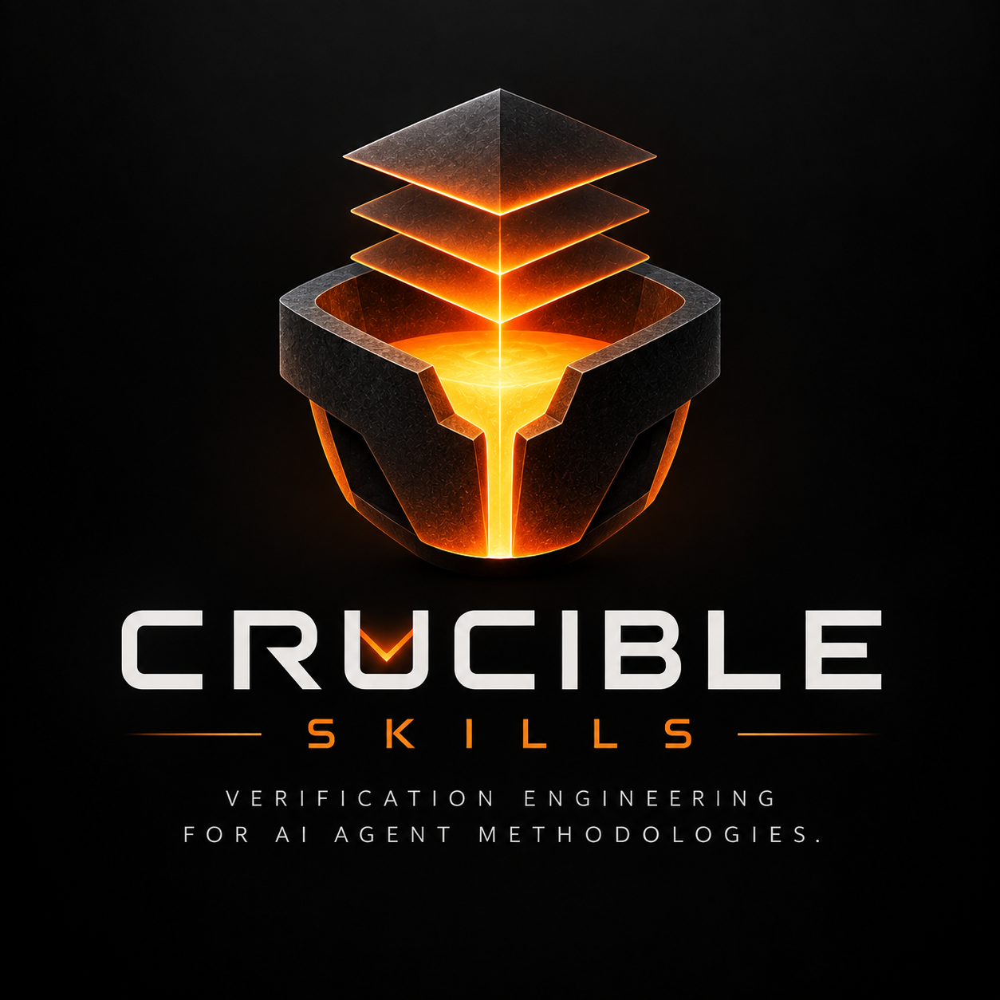

# Crucible Skills

**Ingeniería de verificación para metodologías de agentes de IA.**

[English](README.md) · **Español** · [Technical README](TECHNICAL.md)



> **Estado: en progreso — primero el contrato arquitectónico y de evaluación.**

Las skills de agentes son metodología ejecutable: cambian qué detecta, prioriza, verifica y hace un agente de coding. Ya existen herramientas para validar su forma, buscar comportamiento malicioso y medir si un agente rinde mejor con ellas. Falta una pregunta más difícil:

> **¿La metodología es coherente, verificable, componible y realmente vale la pena agregarla al corpus?**

Crucible Skills busca responderla con evidencia estructurada, no con un puntaje opaco.

## Por qué existe ahora

Las Agent Skills se están convirtiendo en infraestructura. NVIDIA ya está construyendo infraestructura seria alrededor de ellas: SkillSpector cubre riesgos de seguridad y supply chain; SkillEvaluator cubre validación, overlap semántico, datasets sintéticos y evaluación live de agentes; y el catálogo NVIDIA agrega Skill Cards, firmas, benchmarks y gates de publicación. Queremos esos controles. CRUCIBLE no existe porque sean insuficientes o irrelevantes, sino porque no agotan la pregunta metodológica.

> **Una skill no necesita ser maliciosa para ser una mala metodología. Puede ser perfectamente benigna y aun así enseñar a un agente a construir mal.**

Ejemplo:

```text
Skill A: reintentar operaciones fallidas hasta tener éxito.
Skill B: las acciones irreversibles deben ser acotadas y revisables.

Ninguna es necesariamente maliciosa por separado.
La composición falla cuando el objetivo del retry es irreversible y no idempotente.
```

CRUCIBLE intenta hacer ese tipo de afirmación inspeccionable, condicional y falsable. Es una capa complementaria de verificación metodológica, no un reemplazo de un security scanner ni de un evaluator conductual. Ver la [frontera competitiva](docs/COMPETITIVE_BOUNDARY.md).

## La idea en un ejemplo

Dos skills pueden parecer razonables por separado y producir una composición incorrecta:

```text
Skill A: reintentar operaciones críticas hasta que tengan éxito.
Skill B: las operaciones irreversibles deben tener efectos acotados y revisables.

Plausibles por separado → composición insegura cuando el retry duplica un efecto irreversible.
```

Crucible extrae reglas declaradas, scopes, triggers, checks, referencias y aristas de composición; después audita contradicciones, verificaciones ausentes, redundancia, provenance rota y resistencia a mutaciones.

## Estado del documento

Esta versión es una adaptación de trabajo en español. La especificación pública y el roadmap canónico están en inglés; el plan operativo en español se mantiene local e ignorado por Git para poder iterarlo durante el hackathon.

Ver el detalle completo en el [Technical README](TECHNICAL.md) y el mapa de construcción en [ROADMAP.md](docs/ROADMAP.md).

## Estado de implementación

Ya existen cinco niveles coherentes: el compilador L1 transforma un corpus real en una Skill IR versionada, con source spans y digest SHA-256 determinista; el auditor L2 consume esa IR, emite findings con evidencia y estado epistémico (CONFIRMED / CANDIDATE / OBSERVATION), sella un AuditArtifact (`crucible-audit/v1`) y documenta cinco checks abstados como limitaciones explícitas; el grafo L3 extrae aristas tipadas de relaciones desde headings de sección y texto de descripción (sibling of, pairs with, composes with, member of the family, companion to), los clasifica en composition/reinforcement/delegation, detecta hubs y componentes desconectados, y sella un GraphArtifact (`crucible-graph/v1`); el laboratorio L4 siembra 8 clases de defectos contra un fixture conocido-bueno, corre el pipeline completo, y clasifica cada resultado como KILLED / SURVIVED / ABSTAINED con clasificación honesta de survivors (INSUFFICIENT_DETECTOR, INSUFFICIENT_REPRESENTATION, OUT_OF_SCOPE), kill rate 4/6; y el diferencial conductual L5 corre el mismo task contra 4 variantes de skill (no-skill, original, mutante, repair), observa 4 propiedades explícitas con un oracle determinista, y sella el reporte. El executor local muestra el diferencial esperado (el mutante falla P3: unbounded retry). El executor Nebius/Nemotron es código real usando el Token Factory API; la ejecución está BLOCKED hasta que haya una API key. El modelo es sujeto de observación, no juez. El workflow de Bob, el loop de repair cerrado, y la UI siguen explícitamente en progreso.

## Principio de construcción

El destino es un sistema completo de verificación de metodología. El tiempo decide hasta qué nivel coherente llegamos; no convierte los niveles no alcanzados en prototipos descartables. Cada nivel debe ser útil, compatible con el siguiente y conservar los invariantes anteriores.

## Licencia

Apache-2.0. Ver [`LICENSE`](LICENSE).
