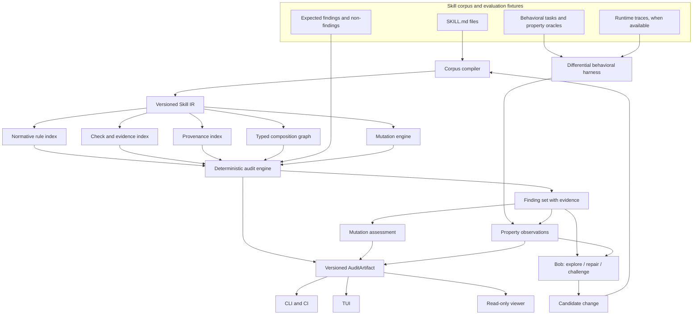

# Crucible Skills — Technical README

**Status: In progress.** This document is the technical contract under construction; it is intentionally more precise than the public README and records decisions before implementation hardens them.


## 1. System thesis

An agent skill is not merely Markdown. It is a portable methodology that can change an agent's decisions across tasks. Therefore, a corpus needs more than file validation and security scanning. It needs an inspectable representation of:

- what the skill claims;
- when it activates;
- what it requires, forbids, or permits;
- what evidence can verify those requirements;
- which other methodologies it composes with;
- whether the combined corpus remains coherent;
- whether deliberate defects are detected;
- whether the declared methodology changes observable agent behavior.

Crucible's central boundary is:

```text
Bob / an LLM may investigate and propose.
Crucible's deterministic core decides whether the evidence satisfies the contract.
```

An optional model may narrate or rank candidates after the deterministic artifact exists. It is not the authority for a consequential verdict.

Current external boundary: NVIDIA's public ecosystem already covers security scanning, validation, semantic overlap/deduplication, live agent evaluation, signatures, Skill Cards, and benchmark artifacts. CRUCIBLE therefore narrows its intended contribution to methodology-level IR, typed conditional composition, requirement-to-oracle coverage, and mutation testing of the verifier. See [`docs/COMPETITIVE_BOUNDARY.md`](docs/COMPETITIVE_BOUNDARY.md). The boundary remains partly experimental: conditional contradiction, inferred invariants, and marginal utility are `UNKNOWN / NEEDS EXPERIMENT` until fixtures establish them.

## 2. Destination architecture



The artifact is the integration contract. All interfaces consume the same artifact; none reimplements decision logic.

## 3. Construction levels

The levels are coherent product states, not technical departments. Security, determinism, provenance, and authority boundaries apply from the first level that needs them.

| Level | Coherent state | Exit evidence |
|---|---|---|
| L1 | Corpus compiler and versioned Skill IR | **Implemented:** a real corpus compiles with stable identities, source spans, nested/block frontmatter support within the declared subset, and a deterministic artifact digest. |
| L2 | Deterministic single-corpus auditor | **Implemented:** the auditor consumes the L1 IR, emits findings with source evidence and epistemic status (CONFIRMED / CANDIDATE / OBSERVATION), seals an AuditArtifact (`crucible-audit/v1`), and documents five abstained checks as explicit limitations. Cross-process digest verified identical. |
| L3 | Typed composition graph | **Implemented:** the graph extracts typed relation edges from L1 section headings and description text (sibling of, pairs with, composes with, member of the family, companion to), classifies them into composition/reinforcement/delegation, and detects hubs, broken edges, disconnected components, and isolated skills. The real corpus produces 83 edges, 12 hubs, 4 components. Three semantic checks are abstained (conditional contradiction, semantic redundancy, producer/consumer typing). |
| L4 | Mutation laboratory | Seeded defects produce expected killed/survived results. |
| L5 | Behavioral differential harness | Baseline/original/mutant/repaired runs use explicit task properties. |
| L6 | Bob engineering workflow | Bob can investigate and propose changes without becoming the verdict authority. |
| L7 | Closed repair loop | Candidate repairs pass re-audit and replay or are rejected with evidence. |
| L8 | Repository/CI integration and read-only viewer | The same artifact works in developer, CI, and presentation workflows. |

The project may stop at any last fully closed level. It must not claim later levels merely because their interfaces exist.

## 4. Skill IR draft

The IR is intentionally typed and source-addressable. Exact serialization is pending implementation, but the following fields are load-bearing:

```yaml
SkillIR:
  schema_version: 0.x
  identity:
    name: stable-name
    source_path: relative/path/SKILL.md
    content_digest: sha256:...
  metadata:
    description: ...
    declared_triggers: []
    license: ...
  scope:
    inclusions: []
    exclusions: []
    source_spans: []
  rules:
    - id: rule-local-id
      modality: MUST | MUST_NOT | SHOULD | SHOULD_NOT | MAY
      subject: normalized capability or actor
      predicate: normalized obligation
      conditions: []
      exceptions: []
      source_spans: []
  checks:
    - id: check-local-id
      target_rule_ids: []
      oracle_kind: explicit | structural | behavioral | human_required
      source_spans: []
  relations:
    composes_with: []
    delegates_to: []
    references: []
  claims:
    - text: ...
      numeric: false
      provenance_refs: []
      source_spans: []
```

The IR must preserve raw text and source spans. Normalization creates analysis views; it must not erase the original evidence. L1 currently supports the bounded frontmatter subset recorded in [ADR-0002](docs/decisions/0002-conservative-frontmatter-parser.md); it does not claim full YAML semantics.

## 5. Finding taxonomy

Initial finding classes are deliberately narrower than “bad skill”:

- `BROKEN_REFERENCE` — a declared reference or composition target cannot be resolved.
- `ORPHAN_SKILL` — a corpus-level graph observation, not automatically a defect.
- `COMPOSITION_CYCLE` — a cycle exists in a relation whose semantics prohibit cycles.
- `NORMATIVE_CONFLICT` — incompatible modalities/predicates overlap under compatible conditions.
- `SCOPE_TRIGGER_MISMATCH` — activation claims and declared scope disagree.
- `REQUIREMENT_WITHOUT_CHECK` — a normative rule has no identified verification path.
- `CHECK_WITHOUT_ORACLE` — a check claims verification without a falsifiable oracle.
- `CLAIM_WITHOUT_PROVENANCE` — a claim requiring external support lacks a source.
- `DESCRIPTION_BODY_GAP` — the public promise has no corresponding rule/check evidence.
- `STRUCTURAL_REDUNDANCY` — substantial duplicate methodology, distinct from composition.
- `MUTATION_SURVIVED` — the auditor failed to detect a seeded defect that should be in scope.

Findings must carry source spans, rule IDs, relation IDs, the violated invariant, and an explicit epistemic status. A candidate semantic conflict is not automatically a confirmed defect.

## 6. Composition semantics

Similarity is not a verdict. Relations are classified by the decision each skill changes:

| Relation | Meaning | Typical evidence |
|---|---|---|
| Redundancy | Same decision, same scope, no additional boundary | normalized rule overlap and equivalent checks |
| Composition | One skill establishes a property another consumes or specializes | typed producer/consumer edge |
| Reinforcement | Same decision reached from distinct, intentional boundaries | separate scope and compatible obligations |
| Contradiction | Same activation conditions require incompatible decisions | overlapping conditions plus incompatible predicates |

The first implementation may emit candidates when semantic adjudication is not deterministic. It must say `CANDIDATE`, not silently promote uncertainty to a verdict.

## 7. Mutation laboratory

Mutations model realistic methodology degradation, not random text noise:

| Mutation | Expected pressure |
|---|---|
| `MUST ↔ MUST_NOT` | normative polarity and contradiction checks |
| remove an exception | boundary and overgeneralization checks |
| break a reference | provenance and graph integrity |
| remove a check | requirement-to-verification coverage |
| add an unsupported numeric claim | claim provenance |
| widen a trigger | activation contamination |
| replace enforcement with an application check | enforcement illusion |
| introduce a prohibited cycle | graph invariants |
| duplicate an existing capability | marginal utility and redundancy |

Every mutant needs a hidden machine-readable expectation: expected findings, expected non-findings, and the property under test. Mutation kill rate is meaningful only when the mutant, oracle, and audit version are pinned.

## 8. Behavioral differential contract

For a selected task, the harness compares:

```text
same task + same agent route
        ├── no skill
        ├── original skill
        ├── mutated skill
        └── candidate repair
```

The harness records observations against explicit properties, not aesthetic preference. A surviving mutant may indicate a weak mutation, weak fixture, ineffective skill, agent override, or insufficient oracle. The report must distinguish these explanations.

## 9. Threat model and authority boundaries

In scope:

- malformed or adversarial `SKILL.md` content;
- misleading metadata, triggers, references, and claims;
- cross-skill composition that creates incompatible obligations;
- mutations designed to evade shallow linting;
- agent-proposed repairs that silence a finding without restoring the property;
- corpus changes between audit runs.

Out of scope for the core claim:

- proving that a skill is globally safe;
- proving that an agent will always follow a skill;
- replacing security scanners for malware, exfiltration, or prompt injection;
- treating an LLM judgment as a formal proof;
- inferring truth from a hash or signature alone.

Trust boundaries:

```text
untrusted skill text ──parse/normalize──> evidence-bearing IR
Bob/model proposal ─────────────────────> untrusted candidate change
deterministic engine ───────────────────> audit artifact authority
artifact projections ───────────────────> CLI/TUI/web/CI consumers
```

The frontend is a viewer. It cannot create a passing finding set by changing presentation data.

## 10. Evidence and reproducibility

Each confirmed result must identify:

- corpus commit and content digests;
- Skill IR schema version;
- auditor version and configuration;
- mutation ID and expected oracle, if applicable;
- task fixture and agent/model route, if behavioral;
- exact observation and artifact path;
- what was not executed or verified.

The project will prefer deterministic output and explicit abstention over an apparently complete but unsupported verdict.

## 11. Model and runtime authority

The NVIDIA model used through Nebius is an experimental behavior generator and observation source, not the authority for deterministic findings. A run must retain model ID, provider/runtime, task digest, corpus/skill digests, sampling controls where available, and the property oracle. A behavioral observation is bounded by that experiment; it is not automatically a universal claim about the methodology.

Imported output from SkillSpector, SkillEvaluator, NVIDIA signatures, or NVIDIA benchmarks is neighboring evidence. It must retain its source, version/commit, artifact identity, and scope. A signature establishes that a directory matches the signed bytes; it does not establish semantic truth. A benchmark establishes what its evaluation measured; it does not establish universal correctness.

The current hackathon requirement matrix and runtime contract are in [`docs/NVIDIA_INTEGRATION.md`](docs/NVIDIA_INTEGRATION.md). The evaluation fixtures and negative controls are in [`docs/EVALUATION_PLAN.md`](docs/EVALUATION_PLAN.md).

## 12. Design decisions

Durable decisions live in [`docs/decisions/`](docs/decisions/). The first architectural decision is recorded in [ADR-0001](docs/decisions/0001-deterministic-core-and-artifact.md).

## 13. Red-team posture

Red-team work is intentionally deferred until the first integrated implementation exists, but the charter is already defined in [`docs/red-team/`](docs/red-team/). The final review must attack parser boundaries, normalization collisions, graph semantics, mutation coverage, artifact authority, Bob repair loops, and UI projection integrity.

## 14. License

The project is released under Apache-2.0. See [`LICENSE`](LICENSE).

## 15. Known limitations while in progress

- Natural-language contradiction and entailment are not fully decidable from Markdown.
- Trigger overlap may require a conservative candidate classification before behavioral confirmation.
- “Marginal utility” needs an explicit capability model; it must not become a magic score.
- Runtime composition requires traces with enough provenance to distinguish declared and observed activation.
- The final hackathon submission must document which levels are actually complete.
