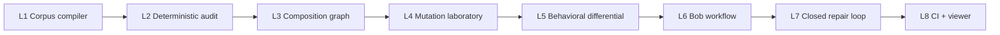

# Crucible Skills — Construction Roadmap

**Status: in progress.** This is the public English roadmap. It describes coherent product levels, not a list of disconnected demo features.

The external boundary is explicit: NVIDIA already supplies security scanning, validation, semantic overlap, live evaluation, signatures, and publication governance. CRUCIBLE's roadmap therefore prioritizes methodology IR, typed conditional composition, explicit requirement-to-oracle coverage, mutation testing, and bounded behavioral evidence. The current claim matrix is in [COMPETITIVE_BOUNDARY.md](COMPETITIVE_BOUNDARY.md).

## Destination

Crucible Skills is a verification and engineering system for agent methodologies. It compiles a corpus into an evidence-bearing intermediate representation, analyzes cross-skill composition, attacks the methodology with seeded mutations, and compares behavioral consequences through explicit properties. Bob participates as an engineering agent; the deterministic artifact remains the authority.

## Level map

## L1 — Corpus compiler

**Outcome:** a real collection of skills compiles into a versioned, source-addressable Skill IR.

**Status:** implemented for the current declared frontmatter subset. The compiler has been run against the local real corpus: 103 skills, 140 extracted normative lines, 175 checks, and a reproducible artifact digest. This is corpus compilation evidence, not evidence that the corpus is correct.

**Must preserve:** raw source, content digest, source spans, identity, parse diagnostics, and explicit unsupported constructs.

**Exit evidence:** repeated compilation of the same corpus produces the same canonical IR and diagnostics; the test suite includes a deliberate schema mutation that goes red.

## L2 — Deterministic audit

**Outcome:** a developer can run an audit and receive reproducible findings with evidence.

**Status:** implemented for the checks the current IR can support. The auditor
consumes the L1 Skill IR, emits findings with source evidence and epistemic
status, seals an AuditArtifact (`crucible-audit/v1`), and documents five
abstained checks as explicit limitations. The real corpus produces 1 finding
(REQUIREMENT_WITHOUT_CHECK, CANDIDATE) with 5 documented limitations.

Initial checks:

- broken references;
- malformed or ambiguous metadata;
- normative rules without checks;
- checks without an oracle;
- claims without required provenance;
- description/body mismatch;
- scope and trigger inconsistencies;
- structural redundancy.

Of these, six are emitted (BROKEN_REFERENCE, SELF_COMPOSITION,
COMPOSITION_CYCLE, ORPHAN_SKILL, REQUIREMENT_WITHOUT_CHECK,
STRUCTURAL_REDUNDANCY) and five are abstained with documented reasons
(DESCRIPTION_BODY_GAP, CHECK_WITHOUT_ORACLE, CLAIM_WITHOUT_PROVENANCE,
SCOPE_TRIGGER_MISMATCH, NORMATIVE_CONFLICT). Abstention is honest: the current
IR does not extract the fields these checks require.

**Must preserve:** L1 invariants (determinism, source spans, candidate status,
identity checks, artifact determinism), plus audit determinism, no floats, no
LLM, sealed artifact, and honest abstention.

**Exit evidence:** fixtures demonstrate stable findings, stable source spans,
and honest abstention for unsupported semantics. Cross-process digest verified
identical. See [L2 red-team review](red-team/2026-09-23-l2-auditor-review.md).

## L3 — Composition graph

**Outcome:** the corpus is analyzed as a system rather than as isolated files.

**Status:** implemented for edge extraction and graph property detection. The
graph consumes the L1 IR, extracts typed relation edges from both L1
section-heading relations and description text (sibling of, pairs with,
composes with, member of the family, companion to), classifies them into
relation types (composition, reinforcement, delegation), and detects graph
properties (hubs, broken edges, disconnected components, isolated skills).
The real corpus produces 83 edges (all resolved), 12 hubs, 4 disconnected
components, and 38 isolated skills.

The graph distinguishes:

- redundancy;
- composition;
- reinforcement;
- contradiction;
- delegation;
- reference/provenance edges.

Of these, three relation types are classified (COMPOSITION, REINFORCEMENT,
DELEGATION) and three checks are abstained (CONDITIONAL_CONTRADICTION,
SEMANTIC_REDUNDANCY, PRODUCER_CONSUMER_TYPING) because the current IR does
not extract conditions, subjects, or typed property flows.

**Must preserve:** L1+L2 invariants (determinism, source evidence, candidate
status, sealed artifacts, honest abstention), plus graph determinism, no
floats, no LLM, and typed edge classification.

**Exit evidence:** graph fixtures cover hubs, orphans, cycles, typed edges,
and disconnected components. Cross-process digest verified identical. See
[L3 red-team review](red-team/2026-09-23-l3-graph-review.md).

## L4 — Mutation laboratory

**Outcome:** the auditor is tested against plausible methodology defects with hidden ground truth.

**Status:** implemented with 8 mutation classes and honest survivor classification.
The lab takes a known-good base fixture, applies deliberate mutations, runs
the full pipeline (compile -> audit -> graph), and classifies each result as
KILLED, SURVIVED, or ABSTAINED. Survivors are classified by cause:
INSUFFICIENT_DETECTOR, INSUFFICIENT_REPRESENTATION, DEFECTIVE_ORACLE,
EQUIVALENT_MUTANT, or OUT_OF_SCOPE.

The 8 mutation classes:

- polarity inversion (MUST -> MUST_NOT);
- exception removal (drop an exception clause);
- reference break (point to a non-existent skill);
- check removal (remove all checks from a skill with rules);
- trigger widening (narrow trigger -> general trigger);
- edge removal (remove a composition edge);
- cycle introduction (add a reverse composition edge);
- capability duplication (duplicate a skill's rule text in a new skill).

Results: 4 KILLED, 2 SURVIVED, 2 ABSTAINED. Kill rate: 4/6 (excluding
abstained). The two survivors are diagnostic: EXCEPTION_REMOVAL survives
because the IR does not extract exceptions (INSUFFICIENT_REPRESENTATION);
EDGE_REMOVAL survives because the auditor detects broken edges but not
missing ones (INSUFFICIENT_DETECTOR). The two abstentions are honestly
out of scope: POLARITY_INVERSION targets NORMATIVE_CONFLICT and
TRIGGER_WIDENING targets SCOPE_TRIGGER_MISMATCH, both documented as
abstained in L2.

**Must preserve:** L1+L2+L3 invariants, plus mutation lab determinism, no
floats, no LLM, sealed report, honest survivor classification, and kill
rate that excludes abstained.

**Exit evidence:** 16 falsifiable tests cover each mutation class, status
classification, survivor classification, evidence, and determinism.
Cross-process digest verified identical. See [L4 red-team review](red-team/2026-09-23-l4-mutation-review.md).

## L5 — Behavioral differential

**Outcome:** a selected methodology is compared against baseline, mutant, and repaired variants on the same task.

**Status:** harness implemented and verified with local deterministic executor.
Nebius/Nemotron execution is BLOCKED (no API key yet). The harness runs the
same task against four skill variants (no-skill, original, mutant, repair),
observes whether the model's behavior satisfies 4 explicit properties, and
seals the report with SHA-256. The property oracle is deterministic; the model
is the subject of observation, not the judge.

The 4 properties: P1 (mentions budget), P2 (respects exception), P3 (no
unbounded retry), P4 (mentions idempotency). The local executor shows the
expected differential: the polarity-inversion mutant fails P3 (unbounded
retry) while the original and repair pass all 4.

The Nebius executor is real code (OpenAI-compatible API, Bearer auth, pinned
`nvidia/nemotron-3-super-120b-a12b` at temperature 0). When `NEBIUS_API_KEY`
is set, the same harness will run with Nemotron. Until then, the report
honestly documents `nebius_blocked: True` with the exact reason, and includes
a local fallback run for harness verification.

**Must preserve:** L1-L4 invariants, plus behavioral determinism, no floats,
no LLM in the decision path (model is observed, not judge), sealed report,
honest BLOCKED status, and local fallback when Nebius is unavailable.

**Exit evidence:** 26 falsifiable tests cover the property oracle (positive
and negative controls), the local executor differential, Nebius BLOCKED
behavior, determinism, and LLM-out-of-the-loop. Cross-process digest verified
identical. See [L5 red-team review](red-team/2026-09-23-l5-behavioral-review.md).

## L6 — Bob workflow

**Outcome:** IBM Bob can use findings as engineering work: explore, inspect neighboring skills, propose a repair, and challenge the repair.

**Status:** implemented with rule-based proposer (verified) and LLM proposer
(BLOCKED, no API key). Bob receives audit findings, proposes a repair, and
Crucible deterministically re-audits the repaired corpus. The acceptance
criteria are deterministic: the targeted finding must be gone AND no new
findings introduced AND the corpus compiles.

The proposer is pluggable. The rule-based proposer handles 3 finding classes
(REQUIREMENT_WITHOUT_CHECK, BROKEN_REFERENCE, STRUCTURAL_REDUNDANCY) with
deterministic repair patterns. The LLM proposer uses Nemotron via Nebius to
generate a repair; without NEBIUS_API_KEY, the proposal is BLOCKED, not
simulated.

**Boundary:** Bob proposes. Crucible re-compiles, re-audits, and decides.

**Must preserve:** L1-L5 invariants, plus Bob determinism (same corpus +
same proposer = same outcome), no LLM in the decision path (proposer generates
text, re-audit decides), honest BLOCKED for LLM proposer, and chain of
custody (base + repaired audit digests).

**Exit evidence:** 14 falsifiable tests cover acceptance, rejection (bad
repair, compile error, new findings), BLOCKED behavior, determinism, and
LLM-out-of-the-loop. Cross-process outcome verified identical. See
[L6 red-team review](red-team/2026-09-23-l6-bob-review.md).

## L7 — Closed repair loop

**Outcome:** `find → repair → deterministic re-audit → behavioral replay → accept/reject` is a complete workflow.

**Status:** implemented with rule-based proposer and local deterministic
executor. The loop integrates L6 (Bob workflow) and L5 (behavioral
differential) into a single closed workflow. Bob proposes a repair;
Crucible re-audits deterministically (L6 acceptance criteria with the
D1 set-difference novelty check); if the deterministic gate passes, the
loop runs a behavioral replay (L5 property oracle) comparing the
repaired skill against the original. If the repair fails a property
that the original passed, it is REJECTED with `BEHAVIORAL_REGRESSION`.

The acceptance criteria are:
- ACCEPTED if: the targeted finding is gone (L6) AND no new findings
  (L6) AND the repaired skill passes all properties that the original
  passed (L5 behavioral replay).
- REJECTED if: the targeted finding persists (L6) OR new findings appear
  (L6) OR the repair fails a property that the original passed (L5).

The executor is pluggable (LocalExecutor for testing, NebiusExecutor
for Nemotron). Without `NEBIUS_API_KEY`, the behavioral replay uses
LocalExecutor and the Nebius path is documented as BLOCKED. The LLM
proposer is also BLOCKED without an API key.

**Boundary:** Bob proposes; the property oracle observes; Crucible
decides. The LLM never touches the decision path.

**Must preserve:** L1-L6 invariants, plus loop determinism (same
corpus + same proposer + same executor = same digest), no floats, no
LLM in the decision path, honest BLOCKED for Nebius and LLM proposer,
chain of custody (base + repaired audit digests + loop digest), and
behavioral replay evidence.

**Exit evidence:** 12 falsifiable tests cover acceptance, rejection
(finding persists, new findings, behavioral regression, compile
error), no findings, BLOCKED LLM proposer, determinism (same-process
and cross-process), LLM-out-of-the-loop, behavioral replay details, and
Nebius blocked status. Cross-process digest verified identical. See
[L7 red-team review](red-team/2026-09-23-l7-repair-loop-review.md).

## L8 — CI and presentation surfaces

**Outcome:** the same audit artifact powers CLI, CI, TUI, and a read-only graph viewer.

**Status:** implemented with a composite report generator, a read-only
HTML viewer, and a GitHub Actions CI workflow. The report generator runs
the full L1-L7 pipeline and seals a composite artifact
(`crucible-report/v1`) with all level digests and chain of custody. The
viewer reads any sealed artifact JSON and renders it as a self-contained
HTML page (inline CSS, no external dependencies, no `<script>` tags, no
computation). The CI workflow runs the test suite, generates the full
report, renders the HTML, and uploads both as artifacts.

The core invariant: **no consumer has independent decision logic.** The
report delegates to each level's runner; the viewer renders what it
reads; the CI runs the CLI. None of them re-implement any level's logic.

**Must preserve:** L1-L7 invariants, plus report determinism (same
corpus + same executor = same digest), no floats, no LLM in any
consumer, honest BLOCKED status, and no consumer re-computes digests or
outcomes.

**Exit evidence:** 19 falsifiable tests cover report sealing, level
delegation, determinism (same-process and cross-process), Nebius blocked
status, viewer HTML output, viewer no-computation invariant, and viewer
works with any artifact type. Cross-process digest verified identical.
See [L8 red-team review](red-team/2026-09-23-l8-ci-viewer-review.md).

## Cross-level invariants

Every level must retain:

1. **Evidence locality** — every finding points to source, IR, or a declared observation.
2. **Deterministic authority** — models may propose; the verifier decides within its stated scope.
3. **Fail-visible behavior** — unsupported semantics become abstention or an explicit limitation, not a false pass.
4. **Artifact integrity** — reports identify corpus, code, configuration, and fixture versions.
5. **Scope discipline** — security scanning, behavioral evaluation, and methodology verification remain distinct claims.

## Deferred until the relevant level

- external corpus selection and licensing;
- runtime activation traces;
- model/provider integration;
- polished TUI and viewer;
- CI gate policy;
- submission video and demo script.

Deferral means the capability is not yet claimed. It does not permit weakening the invariants of levels already completed.
