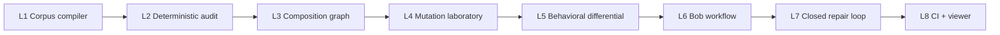

# Crucible Skills — Construction Roadmap

**Status: in progress.** This is the public English roadmap. It describes coherent product levels, not a list of disconnected demo features.

## Destination

Crucible Skills is a verification and engineering system for agent methodologies. It compiles a corpus into an evidence-bearing intermediate representation, analyzes cross-skill composition, attacks the methodology with seeded mutations, and compares behavioral consequences through explicit properties. Bob participates as an engineering agent; the deterministic artifact remains the authority.

## Level map

## L1 — Corpus compiler

**Outcome:** a real collection of skills compiles into a versioned, source-addressable Skill IR.

**Must preserve:** raw source, content digest, source spans, identity, parse diagnostics, and explicit unsupported constructs.

**Exit evidence:** repeated compilation of the same corpus produces the same canonical IR and diagnostics.

## L2 — Deterministic audit

**Outcome:** a developer can run an audit and receive reproducible findings with evidence.

Initial checks:

- broken references;
- malformed or ambiguous metadata;
- normative rules without checks;
- checks without an oracle;
- claims without required provenance;
- description/body mismatch;
- scope and trigger inconsistencies;
- structural redundancy.

**Exit evidence:** fixtures demonstrate stable findings, stable source spans, and honest abstention for unsupported semantics.

## L3 — Composition graph

**Outcome:** the corpus is analyzed as a system rather than as isolated files.

The graph distinguishes:

- redundancy;
- composition;
- reinforcement;
- contradiction;
- delegation;
- reference/provenance edges.

**Exit evidence:** graph fixtures cover hubs, orphans, cycles, typed edges, and at least one conditional conflict.

## L4 — Mutation laboratory

**Outcome:** the auditor is tested against plausible methodology defects with hidden ground truth.

Mutants include polarity inversion, exception removal, broken references, removed checks, unsupported claims, widened triggers, enforcement illusion, cycles, and duplicate capabilities.

**Exit evidence:** mutation kill rate is reported with fixture IDs, oracle definitions, and surviving-mutant explanations.

## L5 — Behavioral differential

**Outcome:** a selected methodology is compared against baseline, mutant, and repaired variants on the same task.

**Exit evidence:** observations are tied to explicit properties; no aesthetic “LLM judge” score is presented as proof.

## L6 — Bob workflow

**Outcome:** IBM Bob can use findings as engineering work: explore, inspect neighboring skills, propose a repair, and challenge the repair.

**Boundary:** Bob proposes. Crucible re-compiles, re-audits, and replays.

**Exit evidence:** a repair candidate is accepted or rejected by the same artifact-producing verification path.

## L7 — Closed repair loop

**Outcome:** `find → explain → mutate/reproduce → repair → deterministic re-audit → behavioral replay → accept/reject` is a complete workflow.

**Exit evidence:** at least one repair restores a property without merely suppressing the original finding, and at least one bad repair is rejected.

## L8 — CI and presentation surfaces

**Outcome:** the same audit artifact powers CLI, CI, TUI, and a read-only graph viewer.

**Exit evidence:** no consumer has independent decision logic; corpus diffs and historical artifacts remain reproducible.

## Cross-level invariants

Every level must retain:

1. **Evidence locality** — every finding points to source, IR, or a declared observation.
2. **Deterministic authority** — models may propose; the verifier decides within its stated scope.
3. **Fail-visible behavior** — unsupported semantics become abstention or an explicit limitation, not a false pass.
4. **Artifact integrity** — reports identify corpus, code, configuration, and fixture versions.
5. **Scope discipline** — security scanning, behavioral evaluation, and methodology verification remain distinct claims.

## Deferred until the relevant level

- external corpus selection and licensing;
- runtime activation traces;
- model/provider integration;
- polished TUI and viewer;
- CI gate policy;
- submission video and demo script.

Deferral means the capability is not yet claimed. It does not permit weakening the invariants of levels already completed.
